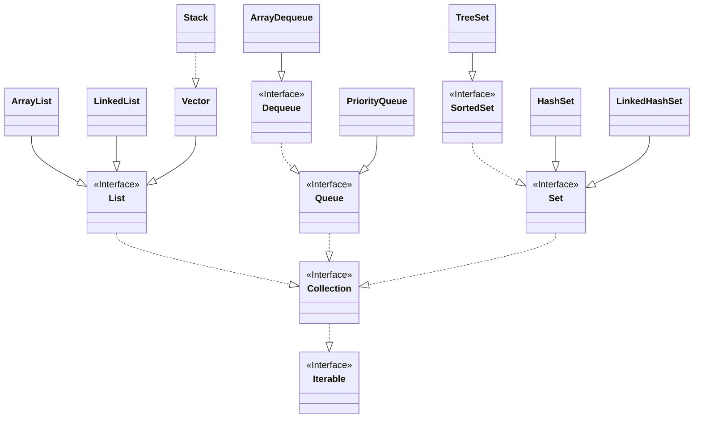
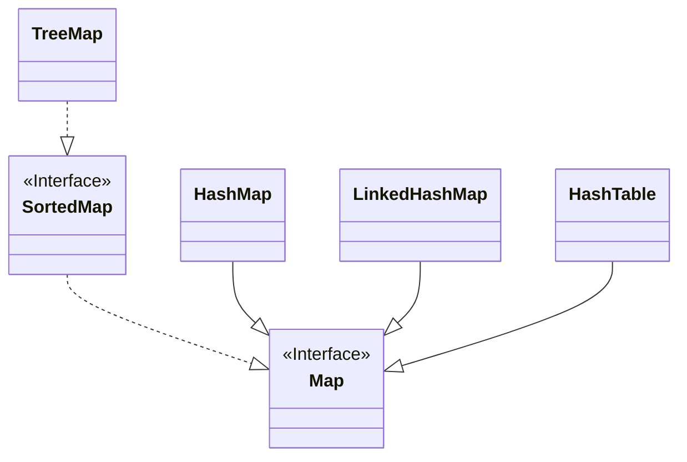

# Collection-Framework

Java Collection Framework, um conjunto de interfaces e classes que simplificam o trabalho com estruturas de dados como listas, conjuntos, filas e mapas.

Estrutura que agrupa elementos objetos em uma estrutura de dados, o elemento precisa ser objeto.

Não aceita primitivo. Use warape se necessario.

Pode ter homogeneas e heterogenias. Se utilizarmos o polimorfismo conseguimos o heterogeneo.

## Map

Todas essas classe e interfaces então dentro do `java.utils`

## Docs Collections Java

[Collection (Java Platform SE 8 )](https://docs.oracle.com/javase/8/docs/api/java/util/Collection.html)
