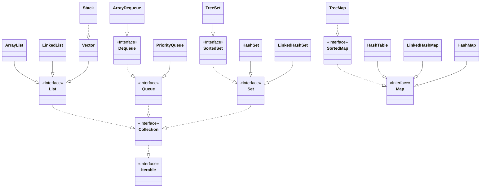

# Collection-Framework
Java Collection Framework, um conjunto de interfaces e classes que simplificam o trabalho com estruturas de dados como listas, conjuntos, filas e mapas.

Estrutura que agrupa elementos objetos em uma estrutura de dados, o elemento precisa ser objeto.

Não aceita primitivo. Use warape se necessario.

Pode ter homogeneas e heterogenias. Se utilizarmos o polimorfismo conseguimos o heterogeneo.

Iterable -> Collection